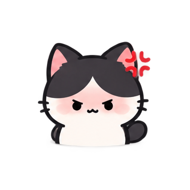
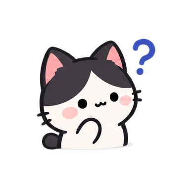

# Gitty

Gitty는 GitHub 활동에 따라 상태와 감정이 변하는 고양이를 README에 표시하는 서비스입니다.

GitHub 사용자는 Gitty를 돌보는 **집사**입니다. Gitty는 **GitHub 활동을 먹고 자랍니다.** 집사가 꾸준히 활동하면 점점 행복해지고, 활동이 끊기면 기다리고, 지치고, 결국 잠들게 됩니다.

```text
GitHub Contribution Calendar
        ↓
Activity Consistency
        ↓
Cat State
        ↓
README Widget
```

특정 commit이나 release 같은 개별 이벤트보다 **GitHub 잔디를 얼마나 꾸준히 심고 있는지**를 중심으로 현재 상태를 결정합니다.

## Contribution Data

Gitty는 GitHub 프로필에 표시되는 Contribution Calendar를 기준으로 활동을 분석합니다.

날짜별 contribution이 하나 이상이면 해당 날짜를 하나의 **활동일(active day)** 로 계산합니다.

- 비공개 contribution 표시를 끈 사용자는 공개 활동만 반영됩니다.
- 비공개 contribution 표시를 켠 사용자는 익명화된 비공개 활동도 함께 반영됩니다.
- 비공개 저장소의 이름이나 구체적인 활동 내용은 조회하거나 노출하지 않습니다.

## Widget

배포된 Gitty 위젯 URL에 GitHub username을 전달해 README에 추가할 수 있습니다.

```md

```

로컬에서는 다음 주소로 확인할 수 있습니다.

```text
http://localhost:3000/api/widget?username=YOUR_USERNAME
```

위젯은 Contribution Calendar를 분석해 결정된 현재 상태의 Gitty 이미지와 상태별 대사를 함께 표시합니다.

## State Flow

Gitty의 기본 상태는 **오늘 활동 여부**에 따라 Positive와 Hunger로 나뉩니다.

```text
                         꾸준한 활동
                             ↑

                            love
                             ↑
                           proud
                             ↑
                          excited
                             ↑
                         cheering
                             ↑
                           happy
                             ↑
                          coding
                             ↑
                          normal
                             │
                       오늘 활동 있음


                       오늘 활동 없음
                             │
                          waiting
                             ↓
                          nervous
                             ↓
                          crying
                             ↓
                           angry
                             ↓
                           tired
                             ↓
                        burned_out
                             ↓
                         sleeping

                             ↓
                         장기 미활동
```

Positive는 최근 활동 빈도와 장기 지속성을 함께 반영하고, Hunger는 마지막 활동 이후 경과한 날짜를 기준으로 결정합니다.

Special State의 조건을 만족하면 기본 Positive/Hunger 상태 대신 Special State가 표시됩니다.

## Cat States

### Positive

오늘 활동이 있을 때 최근 7일·30일의 활동 빈도와 90일·180일의 장기 활동 지속성을 함께 판단합니다.

상위 단계일수록 현재의 활동 흐름뿐 아니라 그 흐름을 얼마나 오래 유지했는지도 반영합니다. 여러 Positive 조건을 만족하면 가장 높은 단계를 선택합니다.

| State | Gitty | Condition |
| --- | :---: | --- |
| `normal` |  | 오늘 활동 · 상위 Positive 조건 미충족 |
| `coding` |  | 최근 7일 중 2일 이상 활동 |
| `happy` |  | 3/7 이상 · 8/30 이상 |
| `cheering` |  | 4/7 이상 · 12/30 이상 |
| `excited` |  | 5/7 이상 · 18/30 이상 |
| `proud` |  | 5/7 이상 · 18/30 이상 · 54/90 이상 |
| `love` |  | 5/7 이상 · 18/30 이상 · 54/90 이상 · 108/180 이상 |

### Hunger

오늘 활동이 없다면 마지막 활동 이후 경과일에 따라 상태가 변합니다.

짧은 휴식은 기다리는 단계에 머물지만, 활동이 장기간 멈출수록 Gitty의 상태도 점차 나빠집니다.

| State | Gitty | Last Activity |
| --- | :---: | --- |
| `waiting` |  | 1–2일 전 |
| `nervous` |  | 3–4일 전 |
| `crying` |  | 5–6일 전 |
| `angry` |  | 7–9일 전 |
| `tired` |  | 10–13일 전 |
| `burned_out` |  | 14–29일 전 |
| `sleeping` |  | 30일 이상 |

### Special

특정 활동 변화가 감지되면 기본 상태 대신 일시적인 Special State가 표시됩니다.
전체 상태의 우선순위는 `confused` → `peeking` → `celebrating` → 기본 Positive/Hunger 순서입니다.

| State | Gitty | Condition |
| --- | :---: | --- |
| `peeking` |  | 30일 이상 활동이 없다가 오늘 다시 활동 |
| `celebrating` |  | 전일과 비교해 오늘 `excited`, `proud`, `love` 단계로 진입 |

`celebrating`은 해당 단계에 처음 도달했을 때뿐 아니라, 상태가 내려갔다가 다시 해당 단계로 진입한 경우에도 표시될 수 있습니다.

### System

GitHub 데이터를 정상적으로 조회하거나 분석할 수 없는 경우 `confused` 상태를 표시합니다.

| State | Gitty | Condition |
| --- | :---: | --- |
| `confused` |  | GitHub 데이터 조회 또는 분석 실패 |

## Development

```bash
pnpm install
cp .env.example .env.local
pnpm dev
```

`.env.local`에 `GITHUB_TOKEN`을 설정합니다.

`GITHUB_TOKEN`은 Gitty를 개발하거나 self-hosting할 때 배포 서버에서 GitHub GraphQL API를 호출하기 위한 **server-side token**입니다. 위젯 사용자는 자신의 GitHub token을 제공하지 않습니다.

개발 서버는 다음 주소에서 확인할 수 있습니다.

```text
http://localhost:3000
```
